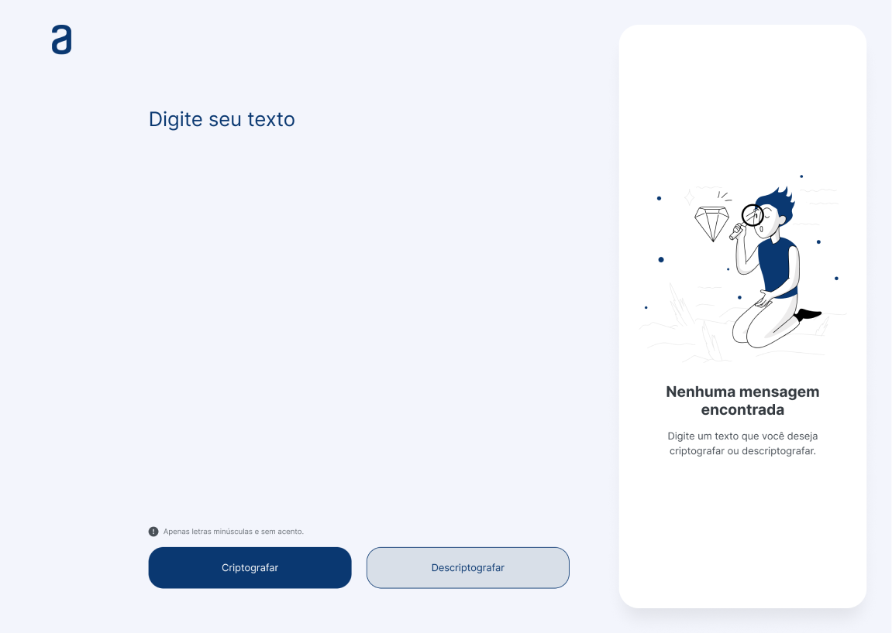

<h1 align="center"> Turing Encrypter</h1>

Esse projeto faz parte do primeiro challenge proposto pela ONE (Oracle Next Education), para praticar os conhecimentos técnicos adquidridos na formação incial para o curso de dev. A ONE é um programa de educação gratuito, promovido pela Alura em parceria com a Oracle para ensino de tecnologias WEB.  

  <a href="#-tecnologias">Tecnologias</a>&nbsp;&nbsp;&nbsp;|&nbsp;&nbsp;&nbsp;
  <a href="#-projeto">Projeto</a>&nbsp;&nbsp;&nbsp;|&nbsp;&nbsp;&nbsp;
  <a href="#-layout">Layout</a>&nbsp;&nbsp;&nbsp;|&nbsp;&nbsp;&nbsp;
  <a href="#memo-licença">Licença</a>

  

 

  

## 🚀 Tecnologias

Esse projeto foi desenvolvido com as seguintes tecnologias:

- HTML e CSS
- JavaScript
- Git e Github
- Figma

## 💻 Projeto

O Turing Encrypter app web que permite encriptar e decodificar mensagens. As "chaves" de criptografia são utilizadas da seguinte maneira:

- A letra "e" é convertida para "enter"
- A letra "i" é convertida para "imes"
- A letra "a" é convertida para "ai"
- A letra "o" é convertida para "ober"
- A letra "u" é convertida para "ufat"

## 📍 Requisitos:

Funciona apenas com letras minúsculas e não é possível utilizar letras com acento e nem caracteres especiais.

- [Visite o projeto online](https://eliasgonzaga.github.io/encrypt-decrypt)

## 🔖 Layout

Você pode visualizar o layout do projeto através [DESSE LINK](https://www.figma.com/file/tvFEYhVfZTjdJ5P24RGV21/Alura-Challenge---Desafio-1---L%C3%B3gica?node-id=2%3A213&t=fZyReHYZbqXd6UTC-0). É necessário ter conta no [Figma](https://figma.com) para acessá-lo.

## :memo: Licença

Esse projeto está sob a licença MIT.

---

Feito com ♥ by Elias Gonzaga :wave: